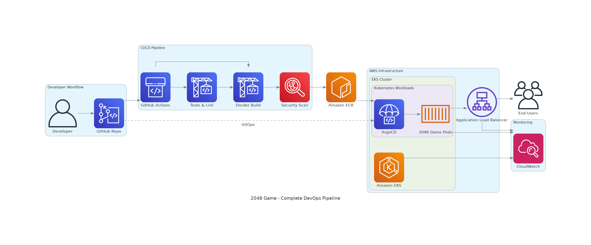
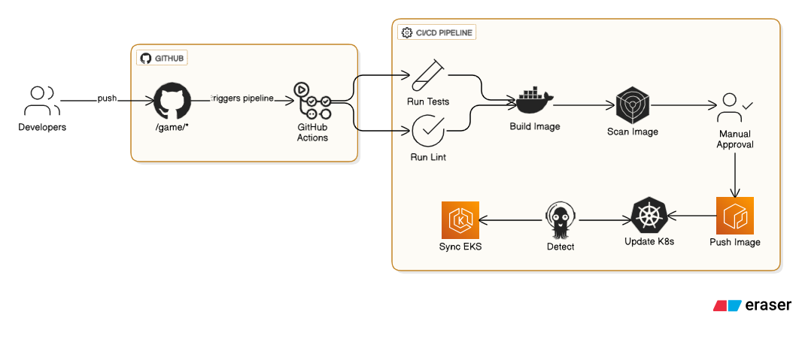

# 🎮 2048 Game - DevOps Edition

A fully containerized and cloud-native implementation of the classic 2048 game with complete CI/CD pipeline, Kubernetes deployment, and Infrastructure as Code.

## 🏗️ Architecture Overview

This project demonstrates modern DevOps practices with:
- **Containerization** with Docker
- **Kubernetes** orchestration
- **GitOps** with ArgoCD
- **Infrastructure as Code** with Terraform
- **CI/CD Pipeline** with GitHub Actions
- **Security Scanning** with Trivy

## 📁 Project Structure

```
├── 📂 .github/workflows/    # CI/CD pipeline
│   └── cicd.yaml           # GitHub Actions workflow
├── 📂 argocd/              # ArgoCD configurations
│   ├── project.yaml        # ArgoCD project definition
│   ├── application.yaml    # Production application
│   └── application-staging.yaml # Staging application
├── 📂 infra/               # Terraform infrastructure code
├── 📂 k8s/                 # Kubernetes manifests
│   ├── deployment.yaml     # Application deployment
│   ├── service.yaml        # Service definition
│   ├── ingress.yaml        # Ingress configuration
│   └── kustomization.yaml  # Kustomize configuration
├── 📂 js/                  # Game JavaScript files
├── 📂 style/               # CSS stylesheets
├── Dockerfile              # Container definition
├── package.json            # Node.js dependencies
└── index.html              # Game entry point
```

## 🚀 Quick Start

### Local Development
```bash
# Run locally with Docker
docker build -t game-2048 .
docker run -p 8080:80 game-2048
# Access at http://localhost:8080
```

### Infrastructure Deployment
```bash
# Deploy infrastructure with Terraform
cd infra
terraform init
terraform plan
terraform apply

# Deploy to Kubernetes
kubectl apply -k k8s/

# Deploy with ArgoCD
kubectl apply -f argocd/project.yaml
kubectl apply -f argocd/application.yaml
```

## 🔄 CI/CD Pipeline



The GitHub Actions workflow automatically:

1. **🧪 Test & Lint** - Runs in parallel
   - JavaScript linting with JSHint
   - HTML validation
   - Unit tests (when available)

2. **🏗️ Build** - Container image creation
   - Multi-stage Docker build
   - Push to Amazon ECR
   - Automatic tagging with git SHA

3. **🔒 Security Scan** - Vulnerability assessment
   - Trivy container scanning
   - Results uploaded to GitHub Security tab

4. **🚢 Deploy** - Automated deployment
   - Updates Kubernetes manifests
   - ArgoCD syncs changes automatically

### Pipeline Triggers
- **Push** to `main` or `develop` branches
- **Pull Requests** to `main` branch

## ☸️ Kubernetes Deployment

### Production Environment
- **Namespace**: `default`
- **Replicas**: 3 pods
- **Resources**: CPU/Memory limits configured
- **Health Checks**: Liveness and readiness probes
- **Service**: LoadBalancer type for external access

### Staging Environment
- **Namespace**: `staging`
- **Prefix**: `staging-` for all resources
- **Branch**: Deploys from `develop`

## 🎯 ArgoCD GitOps

### Project Features
- **Multi-environment** support (production/staging)
- **RBAC** with admin and developer roles
- **Automated sync** with self-healing
- **Resource management** with allow/deny lists

### Applications
- **Production**: Syncs from `main` branch
- **Staging**: Syncs from `develop` branch
- **Auto-sync**: Enabled with pruning and self-heal

## 🏗️ Infrastructure as Code

The `./infra` directory contains Terraform configurations for:
- AWS infrastructure provisioning
- EKS cluster setup (if applicable)
- ECR repository management
- IAM roles and policies
- Networking and security groups

## 🔧 Configuration

### Required Secrets
Configure these in GitHub repository secrets:
```
AWS_ACCESS_KEY_ID       # AWS access key
AWS_SECRET_ACCESS_KEY   # AWS secret key
```

### Environment Variables
```bash
REGISTRY=public.ecr.aws           # Container registry
IMAGE_NAME=game-2048              # Image name
AWS_REGION=us-east-1              # AWS region
```

## 📊 Monitoring & Observability

- **Health Checks**: HTTP probes on `/` endpoint
- **Resource Monitoring**: CPU and memory limits
- **Security Scanning**: Automated vulnerability assessment
- **GitOps Visibility**: ArgoCD dashboard for deployment status

## 🛠️ Development Workflow

1. **Feature Development**
   ```bash
   git checkout -b feature/new-feature
   # Make changes
   git commit -m "Add new feature"
   git push origin feature/new-feature
   ```

2. **Pull Request**
   - CI pipeline runs tests and linting
   - Security scan validates container
   - Manual review and approval

3. **Merge to Develop**
   - Automatic deployment to staging environment
   - ArgoCD syncs changes

4. **Production Release**
   - Merge to main branch
   - Automatic production deployment
   - Image tagged with git SHA

## 🔒 Security Features

- **Container Scanning**: Trivy vulnerability assessment
- **Resource Limits**: CPU and memory constraints
- **RBAC**: Role-based access control in ArgoCD
- **Network Policies**: Kubernetes network segmentation
- **Secrets Management**: Kubernetes secrets for sensitive data

## 📈 Performance

- **Lightweight**: nginx:alpine base image (~23MB)
- **Fast Startup**: Container starts in <5 seconds
- **Resource Efficient**: 64Mi memory, 50m CPU requests
- **Scalable**: Horizontal pod autoscaling ready

## 🤝 Contributing

1. Fork the repository
2. Create a feature branch
3. Make your changes
4. Add tests if applicable
5. Submit a pull request

---

**Built with ❤️ using modern DevOps practices**